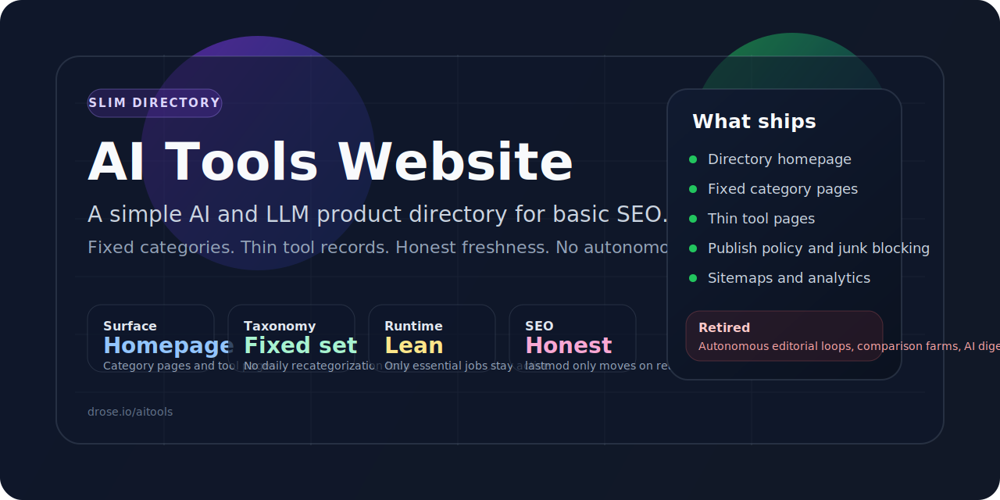
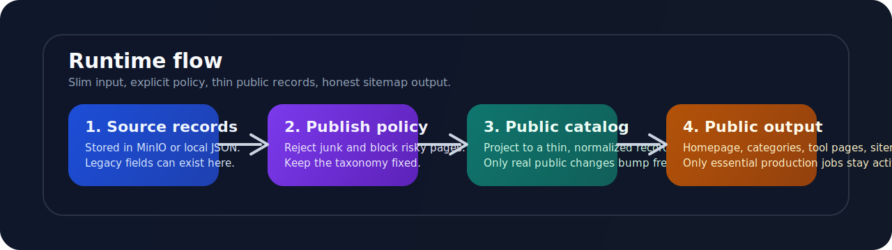

<p align="center">
  
</p>

<p align="center">
  <strong>Simple AI and LLM product directory for basic SEO.</strong><br>
  Fixed categories, thin tool records, honest sitemap freshness.
</p>

> **Live site:** [https://drose.io/aitools](https://drose.io/aitools)

## Quick Links

- [Live site](https://drose.io/aitools)
- [Reset spec](SLIM_DIRECTORY_RESET.md)
- [Local development](#local-development)

# AI Tools Website

AI Tools Website powers `drose.io/aitools`, a slim directory of AI and LLM products.

The project used to behave like an autonomous content machine. It now does something smaller and more defensible: publish clean tool pages, fixed category pages, and honest sitemaps from a normalized public catalog.

## At A Glance

| Area | Current shape |
| --- | --- |
| Live product | Directory homepage, fixed category pages, tool pages |
| Stack | FastHTML + Python |
| Storage | MinIO in production, local JSON in development |
| Deploy | Coolify on `clifford` |
| Scheduler | Sauron |
| Active production jobs | `aitools-sitemaps`, `aitools-umami-watchdog` |

## What This Repo Ships

- directory homepage for AI and LLM products
- fixed category pages
- thin tool pages with normalized metadata
- publish policy and junk blocking
- sitemap generation
- Umami analytics wiring

## What This Repo Explicitly Does Not Ship

- autonomous editorial rewrites
- comparison farms
- daily recategorization churn
- traffic tiering as publish control
- fake freshness timestamps
- AI-written digest emails

<p align="center">
  
</p>

## Operating Principles

| Principle | Meaning |
| --- | --- |
| Fixed taxonomy | Categories do not drift daily. |
| Thin public records | Every published tool is projected into a small, consistent schema. |
| Honest freshness | `updated_at` and sitemap `lastmod` only move when public content changes. |
| Cheap runtime | Production only keeps the jobs that still matter. |
| Policy first | Junk, cheats, and risky pages should not leak into the public directory. |

## Public Catalog

Published tools are projected by [`ai_tools_website/v1/public_catalog.py`](ai_tools_website/v1/public_catalog.py) into a thin public record:

- `name`
- `slug`
- `canonical_url`
- `summary`
- `category`
- `tags`
- `source_type`
- `source_url`
- `metrics`
- `status`
- `risk_flags`
- `discovered_at`
- `updated_at`
- `content_hash`

The rendering layer only needs that thin record plus the publish policy in [`ai_tools_website/v1/editorial.py`](ai_tools_website/v1/editorial.py).

## Repo Map

- [`ai_tools_website/v1/web.py`](ai_tools_website/v1/web.py): homepage, category pages, tool pages, SEO metadata
- [`ai_tools_website/v1/public_catalog.py`](ai_tools_website/v1/public_catalog.py): slim public projection
- [`ai_tools_website/v1/editorial.py`](ai_tools_website/v1/editorial.py): publish policy, tool status, junk blocking
- [`ai_tools_website/v1/maintenance.py`](ai_tools_website/v1/maintenance.py): maintenance CLI, including `slim-reset`
- [`ai_tools_website/v1/sitemap_builder.py`](ai_tools_website/v1/sitemap_builder.py): sitemap generation and publish
- [`SLIM_DIRECTORY_RESET.md`](SLIM_DIRECTORY_RESET.md): first-principles reset spec

## Local Development

```bash
uv sync
uv run uvicorn "ai_tools_website.v1.web:app" --reload --host 0.0.0.0 --port 8000
```

Open `http://localhost:8000/aitools`.

## Core Commands

```bash
# Preview the slim public projection without persisting it
uv run python -m ai_tools_website.v1.maintenance slim-reset --dry-run --json-output

# Persist the slim public projection
uv run python -m ai_tools_website.v1.maintenance slim-reset

# Rebuild sitemaps
uv run python -m ai_tools_website.v1.sitemap_builder

# Run the test suite
uv run pytest

# Lint the codebase
uv run ruff check ai_tools_website tests
```

## Configuration

See [`.env.example`](.env.example) for a working baseline.

Core runtime settings:

- `WEB_PORT`
- `LOG_LEVEL`
- `BASE_PATH`
- `SERVICE_URL_WEB`
- `AITOOLS_STORAGE_BACKEND`
- `AITOOLS_LOCAL_DATA_DIR`
- `TOOLS_FILE`
- `AITOOLS_SLUG_REGISTRY_FILE`
- `MINIO_ENDPOINT`
- `MINIO_ACCESS_KEY`
- `MINIO_SECRET_KEY`
- `MINIO_BUCKET_NAME`
- `MINIO_PUBLIC_URL`
- `UMAMI_WEBSITE_ID`
- `UMAMI_SCRIPT_SRC`
- `UMAMI_DOMAINS`
- `UMAMI_DROSE_ID`

Legacy discovery and content-generation modules still reference model and API settings such as `OPENAI_API_KEY`, `TAVILY_API_KEY`, `SEARCH_MODEL`, `MAINTENANCE_MODEL`, `CONTENT_ENHANCER_MODEL`, and `WEB_SEARCH_MODEL`. Those are not required for the normal slim-directory runtime.

## Deployment Notes

- Coolify deploys both the web container and the updater container.
- Sauron executes maintenance commands inside the updater container with `docker exec`.
- The web process keeps an in-memory tools cache. After changing `tools.json`, redeploy the app or hit the homepage to refresh listings.
- Container-to-LiteLLM traffic should use `http://litellm-proxy:4000`, not the public hostname.
